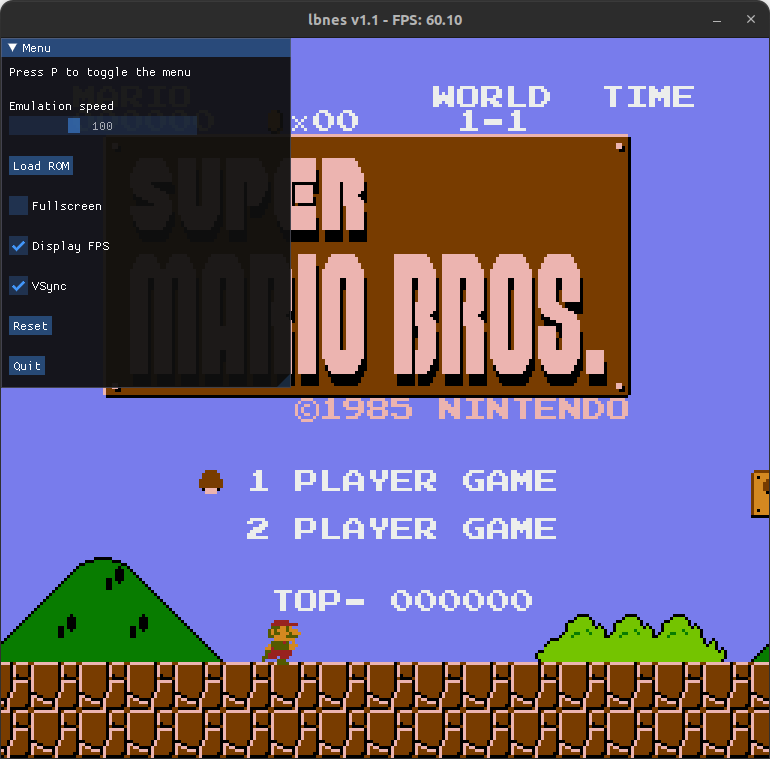

# lbnes

A Nintendo Entertainment System emulator in the works. Written in C++ with SDL2 and ImGui.
Cross-platform support (currently Linux, Windows, Raspberry Pi and macOS). Actively developing new features and adding game support.
Not 100% accurate but it works pretty well.

<p align="center">

</p>

## Releases
Check out the latest stable release on the [releases page](https://github.com/blagalucianflorin/lbnes/releases).
Currently only Ubuntu and Windows-x86, Raspberry Pi 4 builds are available. macOS builds are in the works.

You can also build the emulator yourself, check out the 'Requirements, Clone & Build' section.

## Features
- [x] **mapper 0**
- [x] **drag 'n' drop ROMs**
- [x] **two players support**
- [x] **controller support**
- [x] **configuration file**
- [x] **speed adjustment**
- [x] **key mapping**
- [x] **GUI**
- [x] **save states**
- [ ] network play (work in progress)
- [ ] sound
- [ ] other mappers

## Requirements, Clone & Build

### Linux (Debian) - Ubuntu / Raspberry Pi
```bash
sudo apt install cmake g++ libsdl2-dev
git clone --recursive https://github.com/blagalucianflorin/lbnes
cd lbnes
mkdir bin && cd bin
cmake .. && make
./lbnes <path/to/rom.nes>
```


### Windows (with MinGW)
Install [CMake](https://cmake.org/download/) and [MinGW64](https://winlibs.com/#download-release) and add them to PATH. CMake can be added to path through its install and MinGW64 will have to be added manually (probably "C:\mingw64\bin").

Download the latest [SDL2](https://github.com/libsdl-org/SDL/releases) development VC release and extract it somewhere. Add the extracted folder as an environment variable called SDL_PATH.

Clone this repository (recursive) to a folder and ```cd``` that folder in cmd.
```bash
mkdir bin && cd bin
cmake .. -G "MinGW Makefiles"
mingw32-make
lbnes <path/to/rom.nes>
```

#### (windows) Clion
You could also open this in Clion and build it after installing SDL2 like shown above.

### macOS


Download the latest [SDL2](https://github.com/libsdl-org/SDL/releases) macOS release and copy the SDL2.framework directory to /Library/Frameworks.

```bash
git clone  --recursive https://github.com/blagalucianflorin/lbnes
cd lbnes
mkdir bin && cd bin
cmake .. && make
./lbnes <path/to/rom.nes>
```
